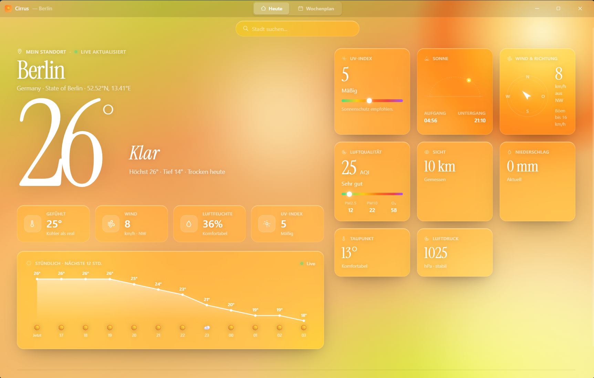

# Cirrus Wetter-App



Cirrus ist eine moderne, native Wetter-Applikation mit atemberaubenden Liquid-Glassmorphism UI-Effekten, dynamischen Animationen und einem responsiven Grid-Layout.

## Features
- **IP Geolocation & Live Search:** Fallback auf IP-Lokalisierung beim Start, schnelle Geocoding-API für die Suche von Orten.
- **Intelligente Dashboards:** Aktuelle Daten inkl. UV, Sichtweite, stündlichem SVG-Chart und umfassendem 7-Tage-Dashboard.
- **Fluid Layout:** Komplett responsives Electron-Vollbild. Detail-Kacheln ordnen sich stufenlos neu an.
- **Dynamic Theming:** Der Hintergrund sowie die App-Elemente passen sich dem aktuellen Wetter an.

## Tech Stack
- **Frontend:** React, TailwindCSS, Vite
- **Backend/Desktop:** Electron, electron-builder
- **Daten API:** Open-Meteo (Weather & Geocoding), ipapi.co

## Entwicklung

### 1. Installation
Installiere alle nötigen Abhängigkeiten:
```bash
npm install
```

### 2. Dev-Modus starten
Startet Vite und Electron im Parallel-Modus mit Hot-Reloading:
```bash
npm run electron:dev
```

### 3. Build & Release
Baut das Web-Projekt (Vite) und verpackt es via electron-builder als Windows NSIS Installer (.exe) im Ordner `/releases`:
```bash
npm run dist
```
